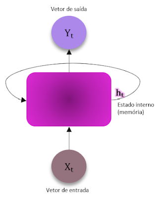
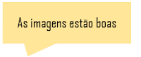
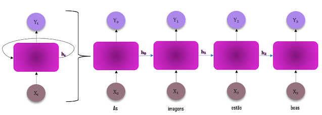
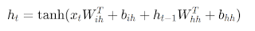
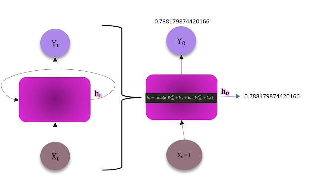
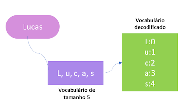
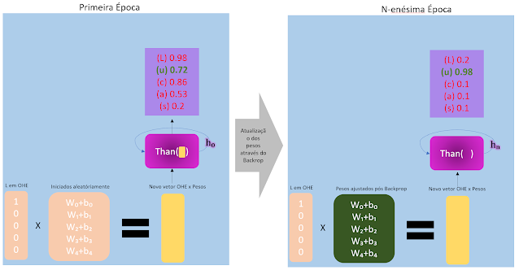

Link do post no Blogger: [POV: Você é uma Rede Recorrente](https://umblogparameuprof.blogspot.com/2024/04/redes-recorrentes.html)

Ok, ok, eu sei, eu também queria estar aqui te ensinando sobre Transformers e LLMs e coisas mágicas que todo mundo no Linkedin tá comentando. Mas, além de que eu sou apenas uma iniciante na área e não possuo total conhecimento para te ofertar, jovem Padawan, eu quero te apresentar uma arquitetura mais antiga PORÉM, mais do que essencial pra gente ter chego tão longe nas arquiteturas.

Sim, é ela mesma: a rede neural recorrente.

Neste blog post vamos conhecer essa diva icônica em termos teóricos e depois vamos botar as mãos na massa com o PyTorch!

#### O castigo do monstro: lidando com problemas sequenciais 
É, o pessoal das MLPs e CNNs também se fizeram esta mesma pergunta. Aqui, problemas sequenciais são aqueles em que precisamos observar a ordem dos dados ao realizar a tarefa. O exemplo mais clássico de problemas que devem ser modelados de forma sequencial é o processamento de linguagem natural, mas séries temporais e sequências genéticas também são outros dois exemplos. Aqui, vamos focar em exemplos da área de PLN para fins de praticidade (e porque eu gosto muito também). 😉

Imagina a seguinte situação:
Queremos fazer um levantamento de qualidade do conteúdo do nosso blog a partir dos comentários dos usuários realizando uma classificação binária para dizer se o comentário em questão é positivo ou negativo. Como sabemos, textos são entradas sequenciais e este tipo de entrada já iria quebrar qualquer MLP pois estas só conseguem lidar com entradas de tamanho fixo e não conseguiriam capturar o contexto dos comentários, iria ser um desastre total!
"Ah, mas se o problema é tamanho fixo, bora usar uma CNN da vida!"
É, CNNs podem sim aceitar entradas com tamanhos variados, mas tem um pequeno grande detalhe: dependendo do tamanho da frase, ela pode acabar perdendo o contexto pois teríamos que ficar adicionando muitas camadas convolucionais para aumentar o campo receptivo delas e eles serem capazes de capturar todo o contexto da frase. Além do escopo do nosso problema, outras tarefas de PLN como tradução de texto exigem que as redes possam aceitar  cenários onde temos uma entrada com um determinado tamanho e retornar uma saída com um tamanho diferente da entrada, e isso não ocorre nessas arquiteturas.

Em terra de sequencinhas, quem guarda hidden states é raínha
As RNRs surgiram justamente para resolver este problema que tínhamos com as entradas (e saídas) sequenciais. Isto porquê essas queridas são capazes de manter um estado que carrega as informações obtidas no passo anterior! Vamos conhecer um pouco melhor a arquitetura dela?

### Redes Neurais Recorrentes

RNRs adicionam uma dimensão de tempo (representado aqui pelo subscrito t) e apresentam uma nova funcionalidade em sua arquitetura que nós chamamos de estado interno ou, mais comumente, os hidden states. Eles são responsáveis por guardar o estado da rede no instante t após processar a entrada X no mesmo instante. Pode parecer confuso lendo, então vamos dar uma abridinha nela usando como exemplo de entrada um comentário fictício do blog.

Assim é uma RNR desdobrada no tempo. Dada a sentença "As imagens estão boas", cada palavra da sentença entra na rede no instante t, faz as computações internas e para o próximo passo no instante t+1 ela envia o estado interno da última entrada vista. Por isso elas são ditas recorrentes: a saída de cada célula da rede depende não somente da entrada mas também do estado interno da célula anterior, criando este 'loop' que chamamos de recorrência.

---

### Mãos na massa com o PyTorch 👩‍💻
Aqui nesta seção, vamos conhecer o PyTorch e o seu módulo dedicado a camadas RNN, o torch.nn.RNN

#### Quem é o PyTorch na fila do pão?
O PyTorch se descreve oficialmente como uma biblioteca otimizada para se trabalhar com tensores em aplicações de aprendizado profundo usando GPUs e CPUs, mas eu gosto de definir ele como um dos melhores (se não o melhor) e mais popular framework para desenvolvimento de modelos de aprendizado profundo. Eles oferecem uma gama de funcionalidades dentro das Python APIs deles que no geral começam com torch.[algum_módulo específico]. Por exemplo, a que vamos utilizar aqui é a torch.nn, uma API Python que oferece diversos building blocks para construir a rede que você deseja com as funções e otimizadores que você precisa.

#### torch.nn.RNN 😎
Esta camada computa, para cada elemento da sequência de entrada, a seguinte função:

Faremos a computação desta função no nosso Jupyter Notebook na sessão Fala menos e faz mais para melhor entendimento, e lá também vou te apresentar o que significa cada elemento dela!
 
Primeiro precisamos entender o que tem nesta camada, o que ela recebe e o que ela retorna. 

##### Como funciona a camada 

**Parâmetros**

Para instanciar um objeto torch.nn.RNN, devemos passar, pelo menos, os seguintes parâmetros:

- input_size: representa o número de features de entradas que vamos ter
- hidden_size: representa o número de features da camada interna

Os outros parâmetros já possuem um valor padrão caso você não os coloque, que são:

- num_layers: número de camadas RNN que você deseja. Por default, 1 camada
nonlinearity: qual a função não-linear que queremos usar, podendo escolher entre a Tanh (que é a default) e a 'ReLu'
- bias: um valor booleano para dizer se queres que a camada use ou não os pesos de bias. Default é que utilize, ou seja, True
- batch_first: valor booleano para indicar se queremos que os dados de entrada e de saída sejão providos no seguinte formato: (tamanho_do_batch, tamanho_da_sequência, feature) ao invés de (tamanho_da_sequência, tamanho_do_batch, feature). O tamanho da sequência geralmente se refere ao tamanho máximo que a sequência vai ter. Por exemplo, dado um vocabulário sobre nomes, o maior nome tem 12 letras. 12 será o tamanho_da_sequência. Por default, ele vem como False.
- dropout: utilizado para dizer se queremos introduzir camas de Dropout nos outputs de cada camada RNN exceto a última, sendo usada a probabilidade referenciada pelo próprio parâmetro dropout. Quando ele vem 0.0, como é o seu valor default, não introduzimos. 
- bidirectional: valor booleano para indicar se a camada deve ser bidirecional o unidirecional. Por default, é False e é unidirecional.

**Entrada, saída e estado interno**

A entrada da camada deve ser um tensor com o seguinte formato, se batch_size=False:

- Tensor(tamanho_da_sequência, batch_size, input_size)
A saída será um tensor com o seguinte formato, se batch_size=False e bidirectional=False:
- Tensor(tamanho_da_sequência, batch_size, hidden_size)
      Caso ela seja bidirecional, será:
- Tensor(tamanho_da_sequência, batch_size, 2 * hidden_size)
E o estado interno será um tensor com o seguinte formato, se bidirectional=False
Tensor(número_de_camadas, batch_size, hidden_size)

### Fala menos e faz mais (e uma pincelada de matemática, pra ficar chique 💅) 💻
Para explorar melhor como funciona a rede, vamos instanciar uma RNN com uma única camada que vai receber um único dado de entrada (e consequentemente de saída) e vai ter um hidden state de apenas uma única feature também. Ou seja, o t dela referente ao tempo, vai ir só até o 0, realizando somente uma única computação.
Instanciada a rede, vamos criar um dado de entrada e um hidden_state inicial, e passar para a camada realizar a computação da função Tahn. 
Depois, vamos acessar todos os atributos  de peso e bias da camada para passar para esta mesma função Tahn e conferir que o resultado é o mesmo.

#### Gerando nomes com uma RNN 🤖

Agora que entendemos um pouco melhor com funcionam as camadas RNN do PyTorch, vamos ver um novo exemplo onde faremos a previsão do próximo caractere para realizar a geração de nomes brasileiros!

##### Quer que desenhe? Pois eu também!

Assim irá funcionar o treinamento da rede para gerar nomes:
Vamos usar como exemplo uma única instância de nome, o nome 'Lucas'.
Nosso vocabulário terá 5 letras e será decodificado pata números e depois tensores.

Além disso, como as redes precisam de entradas numéricas, vamos fazer a representação desse nome como um vetor one-hot-encoding, desta forma

Essa é a representação que vai para a rede, ok?
Então, como queremos que ela faça previsão do próximo caractere, e temos somente o nome 'Lucas', queremos que ela consiga predizer que após o caractere 'L', a maior probabilidade para o próximo caractere seja para o 'u', e assim por diante. Para isso, vamos dar como entrada o vetor OHE de cada letra e através do algoritmo de backpropagation, vamos atualizar os pesos W os bias dela até que ela tenha um erro mínimo entre o caractere que ela previu e o que de fato é esperado.

Depois da rede treinada, ela será capaz de gerar o nome 'Lucas' pois estará com os pesos ajustados para isso!

### Referências:
Capítulo 48 – Redes Neurais Recorrentes. (n.d.). In Deep Learning Book em Português. Recuperado de https://www.deeplearningbook.com.br/redes-neurais-recorrentes/

Karpathy, A. (2015, 21 de maio). The Unreasonable Effectiveness of Recurrent Neural Networks Blog de Andrej Karpathy. Recuperado de https://karpathy.github.io/2015/05/21/rnn-effectiveness/

Loeber, P. (2020, 3 de setembro). PyTorch Tutorial - RNN & LSTM & GRU - Redes Neurais Recorrentes [Vídeo]. YouTube. https://www.youtube.com/watch?v=0_PgWWmauHk&t=331s

Também utilizei como referência alguns materiais do meu professor Lucas Kupssinsku que leciona a cadeira de Aprendizado Profundo I e II na PUCRS.